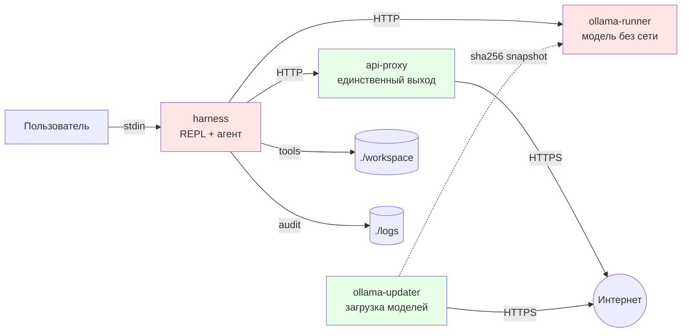

# Архитектура

## Компоненты

Красные — без интернета, зелёные — с интернетом. Только `api-proxy` и
`ollama-updater` видят внешний мир, и оба не имеют доступа к рабочей
директории.

## Сеть

Две Docker-сети:

| Сеть | `internal` | Кто подключён |
|---|---|---|
| `internal-net` | `true` | `harness`, `api-proxy`, `ollama-runner` |
| `external-net` | нет (bridge) | `api-proxy`, `ollama-updater` |

`internal: true` блокирует исходящий трафик на уровне iptables:
контейнер не может обратиться во внешний мир, даже если знает IP.
`harness` и `ollama-runner` подключены только к `internal-net`, то
есть **физически** лишены маршрута наружу.

`api-proxy` — мост. Он подключён к обеим сетям, но:

- слушает только локальный порт 8080,
- требует `X-Proxy-Secret`,
- использует фиксированный словарь маршрутов (хост нельзя подставить),
- не следует редиректам (`follow_redirects=False`).

`ollama-updater` подключён только к `external-net` — ему не нужен
доступ к харнессу. Модели он загружает в staging-том, а не в том
раннера.

## Потоки данных

### Один запрос пользователя

1. Пользователь вводит текст в REPL.
2. `HarnessAgent.run()` вызывает `InjectionGuard.is_suspicious()`.
   При срабатывании — блокировка, ответ пользователю, конец.
3. Формируется список сообщений: `system` + `user`.
4. Цикл `ollama.chat(tools=...)` до `MAX_TOOL_ROUNDS = 6`:
   - модель возвращает текст и/или `tool_calls`;
   - каждый `tool_call` проходит `_dispatch`, результат заворачивается
     в `<tool_result trust="untrusted">`;
   - результат добавляется как сообщение роли `tool`;
   - цикл повторяется, пока модель не ответит без `tool_calls`.
5. Если модель вызвала `propose_write` — запись поставлена в очередь,
   цикл завершается.
6. `main.py` показывает diff или полный текст, ждёт код.
7. `ConfirmSession.apply()` повторно проверяет `check_write` (защита от
   TOCTOU), пишет через `mkstemp` + `os.replace`.
8. Помеченные `[OK]` файлы добавляются в `_written_paths` (по
   каноническому пути).

### Что попадает в контекст модели

- `system` — фиксированный текст, знает про `<tool_result>` и лимиты.
- `user` — ввод пользователя.
- `assistant` — генерация модели.
- `tool` — результат инструмента, обёрнутый в `<tool_result>`.

Всё содержимое файлов и ответов API проходит через
`InjectionGuard.neutralize_data_block()`: теги ролей экранируются,
тройные бэктики заменяются. Это архитектурная защита, не эвристика.

## Границы доверия

| Доверяем | Не доверяем |
|---|---|
| Хост и пользователь | Содержимое файлов в `workspace/` |
| Docker daemon | Ответы внешних API |
| Код харнесса (сами писали) | Генерация модели |
| Образы по digest (если включён пиннинг) | Теги образов по умолчанию |
| `uv.lock` с хешами | PyPI как источник версий |
| sha256-манифест модели | Скачанные веса до верификации |

Подробнее — в [Модель угроз](security-model.md).

## Ключевые инварианты

- Тело `<tool_result>` содержит только данные, прошедшие через
  `neutralize_data_block`. Служебные метаданные (число показанных
  элементов, флаг усечения) живут в атрибутах тега, а не в теле.
- Запись в файл возможна только после `check_write` **и**
  `resolve_write`, вызванных повторно после подтверждения
  пользователем.
- Файл, помеченный как записанный в сессии, недоступен для чтения в
  той же сессии. `_written_paths` хранит канонические пути; сравнение
  сырых строк обходилось бы через `./notes/a.md` vs `notes/a.md`.
- Сеть `internal-net` не имеет исходящего маршрута: попасть во внешний
  мир оттуда нельзя на уровне ядра, а не приложения.
