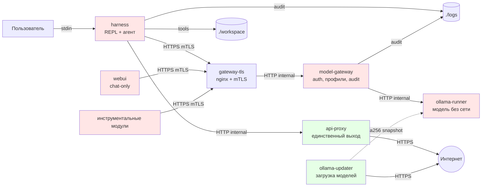

# Архитектура

## Компоненты

Красные — без интернета, зелёные — с интернетом. Только `api-proxy`
и `ollama-updater` видят внешний мир. `ollama-updater` работает по
profile `updater` и в штатном режиме остановлен.

## Сети

Пять Docker-сетей, все с `internal: true` кроме `external-net`:

| Сеть | Кто подключён | Назначение |
|---|---|---|
| `gateway-net` | `harness`, `webui`, `gateway-tls` | mTLS-клиенты и TLS-терминатор |
| `gateway-internal-net` | `gateway-tls`, `model-gateway` | только TLS-терминатор → гейтвей |
| `internal-net` | `model-gateway`, `ollama-runner` | только гейтвей → модель |
| `proxy-net` | `harness`, `api-proxy` | клиенты → прокси (только harness) |
| `external-net` | `api-proxy`, `ollama-updater` | единственный выход наружу |

Ключевые изоляции:

- `ollama-runner` **никогда** не виден клиентам. Он подключён только
  к `internal-net` вместе с `model-gateway`.
- `api-proxy` доступен только `harness` (не `webui`, не другим
  клиентам). Клиент может вызывать внешние API только через свой
  профиль, если у него есть tool `api_call`.
- Клиенты друг друга видят, но mTLS делает подделку трафика
  невозможной без `ca.key`.

## Компоненты

### `harness`

REPL и агент. Tool calling через `model-gateway` (mTLS через
`gateway-tls`). Инструменты: `list_dir`, `read_file`,
`propose_write`, `api_call`. `api_call` идёт в `api-proxy` по
`proxy-net` с `X-Proxy-Secret`. `propose_write` требует
подтверждения пользователем одноразовым кодом (`ConfirmSession`).

### `model-gateway`

FastAPI-гейтвей. Единственная точка, видящая `ollama-runner`.
Задачи:

- аутентификация клиентов (mTLS-сертификат + токен);
- профили: `tools_enabled`, `allowed_tools`, `forced_system_prompt`,
  `model_allowlist`, `requests_per_minute`, `max_concurrent`,
  `allow_stream`;
- fair concurrency (per-client и global семафоры);
- rate limiting (per-client sliding window + per-IP limiter до
  аутентификации — лимитирует **все** попытки, а не только неудачные,
  чтобы спам дорогой верификацией сертификата не упирался в CPU);
- аудит в `logs/gateway.jsonl` — без содержимого промптов.

Подробности — `docs/reference/gateway.md`.

### `gateway-tls`

nginx. Принимает TLS 1.3 с обязательным клиентским сертификатом
(`ssl_verify_client on`). Пробрасывает сертификат в `X-Client-Cert`,
статус верификации — в `X-Client-Verify`, IP клиента — в
`X-Real-IP`. Порт 8443 наружу; порт 8081 — healthcheck через
loopback. Соединение с `model-gateway` — HTTP внутри
`gateway-internal-net`.

### `ollama-runner`

Сервер Ollama. Модели из volume `ollama-models-verified` — снапшот,
проверенный sha256-манифестом. Без доступа в интернет.

### `api-proxy`

Единственный канал в интернет. Слушает порт 8080 на `proxy-net`.
Требует `X-Proxy-Secret`. Использует фиксированный словарь
`ROUTES` — хост берётся из словаря, не из запроса (SSRF-защита).
`follow_redirects=False`. Лимиты `MAX_REQ_BODY` (100 КБ),
`MAX_RESP_BODY` (200 КБ).

### `ollama-updater`

Загрузка моделей. `read_only: true`, только `external-net`,
отдельный staging-volume. Не пересекается с `internal-net`.
Запускается через `docker compose --profile updater`.

## Потоки данных

### Один запрос пользователя в REPL

1. Пользователь вводит текст в `harness`.
2. `HarnessAgent.run()` проверяет `InjectionGuard.is_suspicious()`.
3. Формируется контекст: `system` + `user`.
4. Цикл до `MAX_TOOL_ROUNDS = 6`:
   - модель возвращает текст и/или `tool_calls`;
   - каждый `tool_call` проходит `_dispatch`, результат заворачивается
     в `<tool_result trust="untrusted">`;
   - результат добавляется как сообщение роли `tool`.
5. Если модель вызвала `propose_write` — запись в очереди, цикл
   завершается.
6. `harness/main.py` показывает diff, ждёт nonce.
7. `ConfirmSession.apply()` повторно проверяет `check_write`
   (TOCTOU defense), пишет через `mkstemp` + `os.replace`.

### Запрос модели через гейтвей

1. `harness` открывает HTTPS-соединение с `gateway-tls`, предъявляет
   клиентский сертификат (`harness.crt`/`harness.key`),
   верифицирует сертификат сервера по CA проекта.
2. nginx проверяет клиентский сертификат по CA, пробрасывает его в
   `X-Client-Cert`, статус верификации — в `X-Client-Verify`, IP
   клиента — в `X-Real-IP`.
3. `model-gateway` проверяет `X-Client-Verify == SUCCESS`
   (defense-in-depth), затем верифицирует подпись сертификата через
   `cryptography`, извлекает SAN DNS как имя клиента, находит
   профиль, сравнивает SHA256 токена.
4. `model-gateway` применяет профиль (tools, system prompt, clamps),
   проверяет rate limits, берёт семафоры.
5. `model-gateway` пересылает запрос в `ollama-runner` (HTTP,
   `internal-net`).
6. `model-gateway` пишет событие в `logs/gateway.jsonl`.
7. Ответ возвращается клиенту через nginx.

## Границы доверия

| Доверяем | Не доверяем |
|---|---|
| Хост и пользователь | Содержимое файлов в `workspace/` |
| Docker daemon | Ответы внешних API |
| Код харнесса и гейтвея (сами писали) | Генерация модели |
| Клиентские сертификаты, подписанные CA проекта | Гейтвей-сертификат при первом pull CA |
| Образы по digest (если включён пиннинг) | Теги образов по умолчанию |
| `uv.lock` с хешами | PyPI как источник версий |
| sha256-манифест модели | Скачанные веса до верификации |

Подробнее — [Модель угроз](security-model.md).

## Ключевые инварианты

- Тело `<tool_result>` содержит только данные, прошедшие через
  `neutralize_data_block`. Служебные метаданные (число показанных
  элементов, флаг усечения) живут в атрибутах тега, а не в теле.
- Запись в файл возможна только после `check_write` **и**
  `resolve_write`, вызванных повторно после подтверждения.
- Файл, помеченный как записанный в сессии, недоступен для чтения
  в той же сессии. `_written_paths` хранит канонические пути.
- `internal-net` не имеет исходящего маршрута — попасть во внешний
  мир оттуда нельзя на уровне ядра.
- `model-gateway` не читает содержимое ответов модели — только
  ретранслирует.
